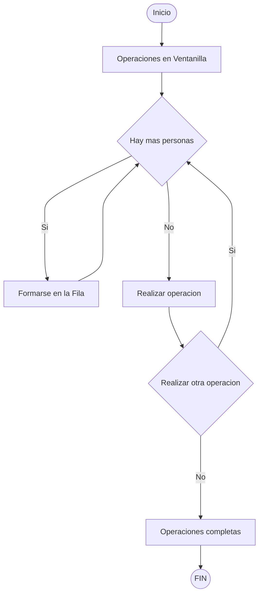

# Terminal
Prueba

## Diagrama de Flujo

## Diagrama de flujo del algoritmo

## Programa en CMD

## Notacion Big O
O(2n): exponencial

## ¿Por qué el color de BBVA es AZUL?
> Porque asi lo ha sido desde 1969.

